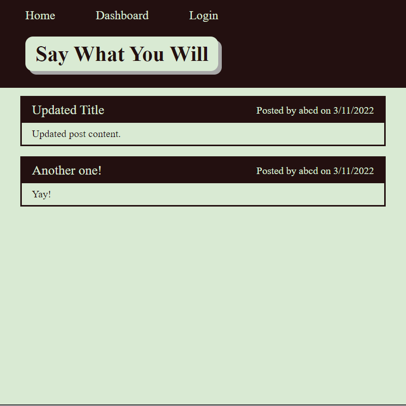

# say-what-you-will

## Description

From front-end to back-end, all the coding was done by me. It is the first time I have built anything from the ground up that includes everything. There is definitely room to grow, but I am happy with it. The basic premise of the site is a blog site, where people can create accounts, make posts, and comment on their posts and others.

The project utilizes npm packages bcrypt, connect-session-sequelize, dotenv, express, express-handlebars, express-session, mysql2, and sequelize.

The code also follows the MVC framework.

## Table of Contents

- [Installation](#installation)
- [Usage](#usage)
- [Contributing](#contributing)
- [Questions](#questions)
  

## Installation

You can download and host it on local if you would like, but it is currently running on Heroku.

[Hosted Heroku Version](https://quiet-caverns-00317.herokuapp.com/)

## Usage

You can test routes with insomnia if you wish, or you can simply make an account and try things out.

## Contributing

This project is not accepting contributions.

## Questions

If you wish to view more of my work, feel free to visit my GitHub account. Additionally, if you have any questions, you can contact me at the email address below. Thanks!

[GitHub](https://github.com/SpencerHulse)

<hulse.spencer@gmail.com>
